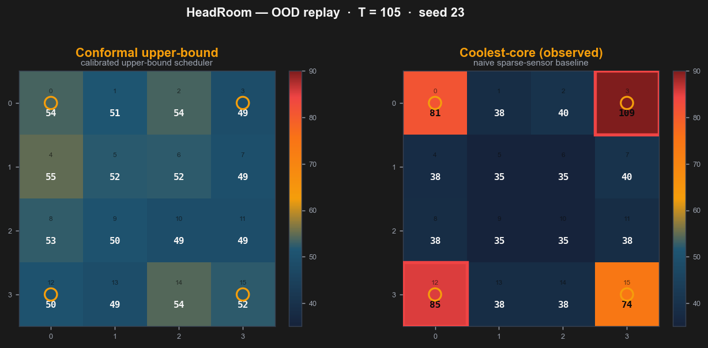

# HeadRoom
> Calibrated upper-bound thermal scheduling for many-core chips.

HeadRoom predicts a **calibrated upper bound** on a 16-core chip's near-future peak
temperature from only 4 sparse, noisy sensors, and places each task on the lowest-risk
core to avoid hotspot violations — then honestly measures where that calibration holds
and where it breaks under workload shift.


## Key Findings
Numbers are mean ± std across 5 workload seeds (re-evaluated on fixed trained models; see
`outputs/reports/metrics_multiseed_*.csv`).

- **Best scheduler under OOD stress.** On out-of-distribution workloads the conformal
  scheduler holds **71.9 ± 1.2 °C with 0.0 ± 0.0 hotspot violations** — cooler and safer than
  the privileged coolest-core oracle (83.5 ± 4.4 °C, 6.6 ± 13.7 violations) and far safer
  than the deployable coolest-core heuristic (130.0 °C, 306.8 ± 35.4 violations), at equal
  throughput (340 ± 14 tasks completed by all schedulers).
- **Calibration holds in-distribution.** Empirical coverage of the calibrated upper bound is
  **95.3 ± 5.2 %** marginal and **95.5 ± 5.2 %** selected-core against a 90 % target on ID data.
- **Calibration collapses under OOD shift.** OOD coverage drops to **46.8 ± 3.4 %**, exactly
  as conformal theory predicts when exchangeability between calibration and deployment breaks.
- **The conformal correction lifts under-covering models to target.** Where the base quantile
  model under-covers, CQR widens the bound to reach the target (e.g. **64.9 % → 90.1 %, +1.85 °C**);
  it is **+0 °C when the base model is already conservative** — conformal only ever widens bounds.


## What This Does Not Claim
- Not validated on real GPU / silicon hardware — simulation only, simplified thermal physics
  (no HotSpot or physical measurement).
- Not an invention of thermal-aware scheduling (established prior work).
- Conformal guarantees are marginal and do **not** hold under arbitrary distribution shift.

## Quick Start
```bash
git clone <repo-url> HeadRoom
cd HeadRoom
pip install -r requirements.txt
python run_all.py --quick        # generate data → train → evaluate → report (~minutes)
streamlit run run_dashboard.py   # launch the dashboard
```
`run_all.py --full` runs the full research settings (200 train / 50 cal / 50 test episodes,
length 500). A hosted-demo build that needs no pipeline run is available via
`streamlit run run_dashboard_demo.py` (reads the small, tracked `demo_data/`).

### How to regenerate
Generated artifacts under `outputs/` are **not** tracked in git. Recreate them any time with
`python run_all.py --quick` (or `--full`). Individual stages also run standalone:
`python run_generate_data.py`, `python run_train_models.py`, `python run_evaluate_schedulers.py`,
and `python run_eval_multiseed.py --quick --seeds 42 17 7 11 23` for the multi-seed numbers.

## Dashboard
A 4-page Streamlit app on the dark HeadRoom identity:
**Watch It Run** (live side-by-side heatmap replay, conformal vs. naive coolest-core) ·
**What We Found** (before/after conformal cards, scheduler comparison, bars, safety-vs-throughput) ·
**Under the Hood** (coverage cards, policy drift, 16-core decision table, model performance) ·
**About** (claims, non-claims, citations). See `docs/DEMO_RECORDING.md` for a 60-second demo script.



## Project Structure
```
thermalguard_cal/   research pipeline (simulator, sensors, features, models, conformal, schedulers, evaluation)
dashboard/          app.py (router) · shared.py · pages/ (4 pages) · figures.py · generate_assets.py
run_all.py          single-command pipeline (data → train → evaluate → report → sanity checks)
run_*.py            standalone stages + run_eval_multiseed.py (multi-seed, no retraining)
demo_data/          small tracked dataset for the hosted demo (run_dashboard_demo.py)
portfolio_assets/   static dark-theme images (architecture, research_summary, comparison_chart, heatmap_demo)
outputs/            generated data / models / figures / reports (gitignored — regenerate via run_all.py)
docs/               tutorial, dashboard guide, metrics glossary, demo recording script
```

## Research Context
Point predictions systematically underestimate tail thermal risk, so a scheduler that trusts
them can place work on a core about to spike. HeadRoom instead builds a calibrated upper bound
with **Conformalized Quantile Regression** (Romano, Patterson & Candès, 2019), which turns an
upper-quantile model into a finite-sample marginal coverage guarantee under exchangeability, and
measures coverage both marginally and **after the scheduler selects a core** — the
selection-conditional regime studied by Jin & Ren (2024) — so the reported guarantee reflects
the decision path that actually ships.

## License
MIT — see [LICENSE](LICENSE).
