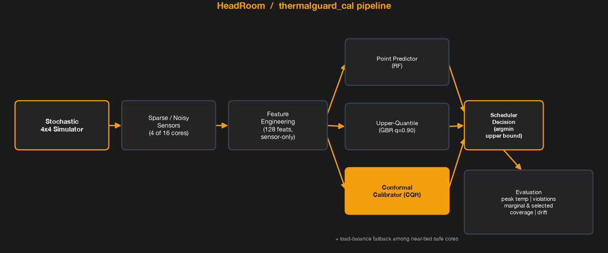
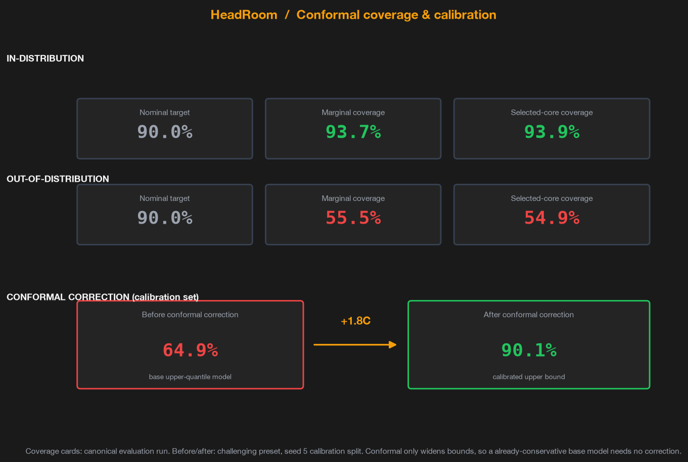

# HeadRoom
> Calibrated upper-bound thermal scheduling for many-core chips.

HeadRoom (package `thermalguard_cal`) is a simulation-based study of **conformalized
thermal scheduling**: it predicts a *calibrated upper bound* on a chip's near-future peak
temperature from sparse, noisy sensors, and places work on the lowest-risk core to avoid
hotspot violations — then honestly measures where those calibration guarantees hold and where
they break.



## What it does
A stochastic 4×4 (16-core) simulator advances a chip with heat gain, ambient cooling, and
diffusion, but only **4 corner cores carry noisy sensors**, so the scheduler never sees the
true chip state. Sensor-only features (128 of them, no true-temperature leakage) feed a point
predictor (random forest) and an upper-quantile model (gradient boosting, q = 0.90), and a
one-sided **conformal calibrator (CQR)** widens the quantile into a calibrated ceiling on peak
temperature. Eight schedulers — from random/round-robin through sparse-sensor heuristics to the
conformal scheduler — are replayed on in-distribution and out-of-distribution workloads, and
the pipeline reports peak temperature, hotspot violations, marginal coverage, selected-core
coverage, and policy-induced distribution drift.

## Key findings
- **OOD safety.** Under out-of-distribution workload shift the naive coolest-core heuristic
  overheats to **130 °C with 352 hotspot violations**, while the conformal scheduler holds
  **72.7 °C with 0 violations** — at equal throughput (363 tasks completed by both).
- **Calibration holds ID, collapses OOD.** On in-distribution workloads the calibrated bound
  tracks the target (marginal coverage **93.7 %**, selected-core **93.9 %**); under OOD shift it
  collapses to **55.5 %** (selected **54.9 %**), exactly as conformal theory predicts when
  exchangeability between calibration and deployment is violated.
- **The correction lifts under-covering models to target.** Where the base quantile model
  under-covers the calibration set, conformal widens the bound to reach 90 % (e.g. challenging
  seed: **64.9 % → 90.1 %, +1.8 °C**). It is **0 °C when the base model is already conservative**
  — conformal only ever widens bounds, never shrinks them.
- **No measurable selection-bias gap on ID.** Selected-core coverage (93.9 %) tracked marginal
  coverage (93.7 %) closely, so choosing one core out of 16 did not introduce a selection bias
  here.



## What this does NOT claim
- Not validated on real GPU/silicon hardware (simulation only).
- Not an invention of thermal-aware scheduling (established prior work).
- Conformal guarantees are marginal and do **not** hold under arbitrary distribution shift.

## Quick start
```bash
# 1. install dependencies
python -m pip install -r requirements.txt

# 2. get the pre-trained models, metrics, and figures (fast path)
unzip -o outputs.zip            # populates outputs/{models,reports,figures}
#    ...or regenerate everything from scratch:
# python run_all.py --quick

# 3. launch the dashboard (from the project root)
python run_dashboard.py
```
The dashboard is a single page with a sticky summary bar, a synchronized dual-heatmap replay
(conformal vs. naive coolest-core), and tabbed analysis (Scheduler Comparison · Calibration ·
Research Findings · About). The sidebar has a one-click demo and PNG export buttons that write
to `portfolio_assets/`.

> The bundled models in `outputs.zip` were pickled with scikit-learn 1.8.x. If unpickling fails
> with a version error, install a matching version or regenerate via `python run_all.py --quick`.

## Project structure
```
thermalguard_cal/      research pipeline (simulator, sensors, features, models,
                       conformal calibrator, schedulers, evaluation) — do not edit for visuals
dashboard/
  app.py               single-page Streamlit dashboard (visual revamp)
  figures.py           shared dark-theme matplotlib figure builders
  generate_assets.py   pre-renders portfolio_assets/{architecture,research_summary}.png
run_dashboard.py       dashboard entry point (keeps the sys.path → thermalguard_cal fix)
run_all.py             end-to-end pipeline (data → train → evaluate → report)
outputs/               generated data, models, figures, reports, multiseed + stress sweeps
portfolio_assets/      static portfolio images (committed; rendered above)
docs/                  tutorial, dashboard guide, metrics glossary, pitch prep
```

## Research context
Point predictions systematically underestimate tail thermal risk, so a scheduler that trusts
them can place work onto a core that is about to spike. A *calibrated upper bound* instead
carries a coverage guarantee: on exchangeable data the true outcome stays under the bound at
the nominal rate. HeadRoom builds that bound with **Conformalized Quantile Regression**
(Romano, Patterson & Candès, 2019) and measures coverage both marginally and **after the
scheduler selects a core** — the regime studied by Jin & Ren (2024) on coverage after
selection — so the reported guarantee reflects the decision path that actually ships, not just
the average candidate.
