# ThermalGuard-Cal Final Report

Generated: 2026-06-19T05:02:45+00:00

## Student Summary: What This Run Means

ThermalGuard-Cal builds a 4x4 chip thermal simulator, generates task-placement
datasets, trains point and upper-bound models, calibrates an upper bound with
one-sided conformal prediction, and compares schedulers. The model predicts the
future peak temperature of the whole chip after assigning a task to a candidate
core.

Scheduler categories: simple baselines use randomness or round-robin placement,
sparse-sensor heuristics use only noisy observed temperatures, the oracle uses
privileged true temperatures for reference, and model-based schedulers use
learned future-temperature predictions. ID means the test workload matches the
training/calibration distribution. OOD means the workload is shifted to hotter,
burstier behavior with more sensor dropout. Coverage means the true future peak
temperature is below the predicted upper bound. Selected-core coverage measures
that coverage only after the scheduler has selected one core.

Schedulers with at least one hotspot violation in this run: coolest_core_observed, trend_aware_observed.
Schedulers with zero hotspot violations in this run: random, round_robin, coolest_core_observed, coolest_core_oracle_true_temp, trend_aware_observed, point_prediction_rf, uncalibrated_quantile, conformal_upper_bound.
Conformal status: Coverage improved or was verified on calibration-like data. What is not proven yet: this is not real
silicon validation, and OOD coverage is not guaranteed. The next experiment is
the challenging preset plus multiseed validation, which checks whether scheduler
choice matters in a harder but non-saturating regime.

| Result verdict | Status |
|---|---|
| Pipeline status | working |
| ID calibration | good |
| OOD calibration | bad |
| Sparse-sensor baseline failure | yes |
| Model-based scheduler advantage | promising |
| Conformal advantage over model baselines | mixed |
| Next needed work | challenging preset + multiseed validation |

## Project Summary

ThermalGuard-Cal is a simulation-based Python MVP for conformal upper-bound
thermal scheduling on a 4x4 many-core chip. It implements a stochastic thermal
simulator, stable in-distribution and separate OOD workload generators, sparse
noisy sensors, action-conditioned datasets, point/quantile/conformal models,
scheduler baselines, fair ID/OOD evaluation, plots, and reports.

Current run preset: **challenging**.

## Prediction Target

The model predicts **future peak chip temperature over the horizon** as a
global whole-chip quantity. It does **not** predict the candidate core's own
future temperature in isolation. Therefore selected-core coverage means
coverage of the global outcome that results from a placement choice.

## Simulator And Workloads

The simulator uses heat gain from active task power, ambient cooling,
4-neighbor diffusion, mild thermal inertia, and small stochastic noise. ID
train/calibration/test episodes share the same stable workload distribution.
OOD episodes use a separate higher-power, burstier mix and higher sensor
dropout. Model features only use sparse/noisy sensor observations and workload
metadata; true temperatures are reserved for simulator physics and labels.

The `coolest_core_oracle_true_temp` row is intentionally labeled as a privileged
oracle baseline because it reads true current temperatures. It is useful as a
simulation reference, not as a deployable sparse-sensor scheduler.

## Model Metrics

| split       | model           | metric               |     value |
|:------------|:----------------|:---------------------|----------:|
| calibration | linear_point    | mae                  |  1.07297  |
| calibration | linear_point    | rmse                 |  1.36562  |
| calibration | linear_point    | max_abs_error        |  4.14925  |
| calibration | forest_point    | mae                  |  0.666128 |
| calibration | forest_point    | rmse                 |  0.928199 |
| calibration | forest_point    | max_abs_error        |  3.10836  |
| calibration | quantile_upper  | empirical_coverage   |  0.944022 |
| calibration | quantile_upper  | average_bound        | 48.9507   |
| calibration | quantile_upper  | average_conservatism |  5.0187   |
| calibration | conformal_upper | empirical_coverage   |  0.944022 |
| calibration | conformal_upper | average_bound        | 48.9507   |
| calibration | conformal_upper | average_conservatism |  5.0187   |
| test_id     | linear_point    | mae                  |  2.51703  |
| test_id     | linear_point    | rmse                 |  3.22232  |
| test_id     | linear_point    | max_abs_error        |  9.58213  |
| test_id     | forest_point    | mae                  |  2.07194  |
| test_id     | forest_point    | rmse                 |  2.66946  |
| test_id     | forest_point    | max_abs_error        |  8.32686  |
| test_id     | quantile_upper  | empirical_coverage   |  0.806416 |
| test_id     | quantile_upper  | average_bound        | 49.4539   |

## Conformal Calibration Diagnostics

Target coverage, quantile alpha, conformal correction, calibration sample count,
and before/after empirical coverage are reported explicitly below.

| metric                                          | split       |       value |
|:------------------------------------------------|:------------|------------:|
| target_coverage                                 | all         |    0.9      |
| quantile_model_alpha                            | all         |    0.9      |
| conformal_correction                            | calibration |    0        |
| conformal_quantile_level                        | calibration |    0.900543 |
| calibration_samples                             | calibration | 1840        |
| calibration_empirical_coverage_before_conformal | calibration |    0.944022 |
| calibration_empirical_coverage_after_conformal  | calibration |    0.944022 |
| id_empirical_coverage_before_conformal          | test_id     |    0.806416 |
| id_empirical_coverage_after_conformal           | test_id     |    0.806416 |
| ood_empirical_coverage_before_conformal         | test_ood    |    0.547852 |
| ood_empirical_coverage_after_conformal          | test_ood    |    0.547852 |

In this run, the quantile model was already conservative on the calibration split, so conformal calibration verified the bound but did not widen it.

## ID Scheduler Metrics

| scheduler                     | baseline_type                       |   peak_temperature |   average_max_temperature |   hotspot_violations |   completed_tasks |   assigned_tasks |   marginal_coverage |   selected_core_coverage |   drift_mean_abs_z |   drift_max_ks |
|:------------------------------|:------------------------------------|-------------------:|--------------------------:|---------------------:|------------------:|-----------------:|--------------------:|-------------------------:|-------------------:|---------------:|
| random                        | deployable_baseline_sensor_observed |            61.4613 |                   45.1019 |                    0 |                60 |              113 |          nan        |               nan        |           0.354136 |       0.669565 |
| round_robin                   | deployable_baseline_sensor_observed |            57.1832 |                   42.7626 |                    0 |                60 |              113 |          nan        |               nan        |           0.378004 |       0.787611 |
| coolest_core_observed         | deployable_baseline_sensor_observed |            74.2219 |                   49.6607 |                    0 |                60 |              113 |          nan        |               nan        |           1.42059  |       0.922283 |
| coolest_core_oracle_true_temp | oracle_privileged_true_temperature  |            56.2574 |                   43.6745 |                    0 |                60 |              113 |          nan        |               nan        |           0.264083 |       0.597076 |
| trend_aware_observed          | deployable_baseline_sensor_observed |            71.3723 |                   49.1873 |                    0 |                60 |              113 |          nan        |               nan        |           1.30965  |       0.913043 |
| point_prediction_rf           | model_based_sensor_observed         |            48.4316 |                   41.3565 |                    0 |                60 |              113 |          nan        |               nan        |           0.231643 |       0.734667 |
| uncalibrated_quantile         | model_based_sensor_observed         |            57.6286 |                   46.623  |                    0 |                60 |              113 |          nan        |               nan        |           0.628219 |       0.886495 |
| conformal_upper_bound         | model_based_sensor_observed         |            51.8487 |                   41.77   |                    0 |                60 |              113 |            0.954646 |                 0.955752 |           0.218569 |       0.660716 |

## OOD Scheduler Metrics

| scheduler                     | baseline_type                       |   peak_temperature |   average_max_temperature |   hotspot_violations |   completed_tasks |   assigned_tasks |   marginal_coverage |   selected_core_coverage |   drift_mean_abs_z |   drift_max_ks |
|:------------------------------|:------------------------------------|-------------------:|--------------------------:|---------------------:|------------------:|-----------------:|--------------------:|-------------------------:|-------------------:|---------------:|
| random                        | deployable_baseline_sensor_observed |            69.5273 |                   48.5953 |                    0 |                51 |              128 |          nan        |               nan        |           0.771183 |       0.734375 |
| round_robin                   | deployable_baseline_sensor_observed |            69.3126 |                   46.3656 |                    0 |                51 |              128 |          nan        |               nan        |           0.633127 |       0.867188 |
| coolest_core_observed         | deployable_baseline_sensor_observed |           109.754  |                   61.7624 |                   24 |                51 |              128 |          nan        |               nan        |           2.43497  |       0.9375   |
| coolest_core_oracle_true_temp | oracle_privileged_true_temperature  |            66.0657 |                   49.5444 |                    0 |                51 |              128 |          nan        |               nan        |           0.725845 |       0.6875   |
| trend_aware_observed          | deployable_baseline_sensor_observed |           103.2    |                   58.2048 |                   15 |                51 |              128 |          nan        |               nan        |           2.2222   |       0.9375   |
| point_prediction_rf           | model_based_sensor_observed         |            57.8936 |                   44.6346 |                    0 |                51 |              128 |          nan        |               nan        |           0.727911 |       0.78125  |
| uncalibrated_quantile         | model_based_sensor_observed         |            74.1664 |                   51.1306 |                    0 |                51 |              128 |          nan        |               nan        |           1.0592   |       0.913043 |
| conformal_upper_bound         | model_based_sensor_observed         |            60.748  |                   44.5723 |                    0 |                51 |              128 |            0.708008 |                 0.710938 |           0.681199 |       0.734375 |

## Coverage Metrics

| split   | scheduler             | coverage_type                             |   nominal_coverage |   empirical_coverage |    n |
|:--------|:----------------------|:------------------------------------------|-------------------:|---------------------:|-----:|
| id      | conformal_upper_bound | marginal_all_candidates_on_visited_states |                0.9 |             0.954646 | 1808 |
| id      | conformal_upper_bound | selected_core_after_scheduler_selection   |                0.9 |             0.955752 |  113 |
| ood     | conformal_upper_bound | marginal_all_candidates_on_visited_states |                0.9 |             0.708008 | 2048 |
| ood     | conformal_upper_bound | selected_core_after_scheduler_selection   |                0.9 |             0.710938 |  128 |

Marginal candidate coverage and selected-core coverage are reported separately.
The difference captures the selection step where the scheduler chooses one
candidate out of 16. Distribution drift is reported separately below and should
not be conflated with the selection-bias coverage gap.

## Does Conformal Add Scheduling Value?

This section compares only `point_prediction_rf`, `uncalibrated_quantile`, and
`conformal_upper_bound`. Conformal should not be called best unless both the
scheduling metrics and coverage metrics support that claim.

| split   | lowest_peak_temperature   | fewest_hotspot_violations   | best_measured_coverage   | conformal_interpretation               |
|:--------|:--------------------------|:----------------------------|:-------------------------|:---------------------------------------|
| id      | point_prediction_rf       | point_prediction_rf         | conformal_upper_bound    | coverage value, similar safety outcome |
| ood     | point_prediction_rf       | point_prediction_rf         | conformal_upper_bound    | coverage value, similar safety outcome |

- For ID, point_prediction_rf has the lowest peak temperature and point_prediction_rf has the fewest hotspot violations.
- For OOD, point_prediction_rf has the lowest peak temperature and point_prediction_rf has the fewest hotspot violations.

Calibration can improve statistical trust even when scheduler outcomes are
similar, because it turns an uncalibrated quantile model into an auditable
coverage claim on calibration-like data. It does not create an OOD guarantee.

## Preset Results

This separates saved preset snapshots from the current canonical CSVs, so the
original normal/easy quick result can be compared against a challenging run when
both have been executed.

| result_group   | scheduler                     |   peak_temperature |   average_max_temperature |   hotspot_violations |   completed_tasks |   selected_core_coverage |
|:---------------|:------------------------------|-------------------:|--------------------------:|---------------------:|------------------:|-------------------------:|
| challenging_id | random                        |            61.4613 |                   45.1019 |                    0 |                60 |               nan        |
| challenging_id | round_robin                   |            57.1832 |                   42.7626 |                    0 |                60 |               nan        |
| challenging_id | coolest_core_observed         |            74.2219 |                   49.6607 |                    0 |                60 |               nan        |
| challenging_id | coolest_core_oracle_true_temp |            56.2574 |                   43.6745 |                    0 |                60 |               nan        |
| challenging_id | trend_aware_observed          |            71.3723 |                   49.1873 |                    0 |                60 |               nan        |
| challenging_id | point_prediction_rf           |            48.4316 |                   41.3565 |                    0 |                60 |               nan        |
| challenging_id | uncalibrated_quantile         |            57.6286 |                   46.623  |                    0 |                60 |               nan        |
| challenging_id | conformal_upper_bound         |            51.8487 |                   41.77   |                    0 |                60 |                 0.955752 |

## Policy-Induced Distribution Drift

Scheduler-level drift summary:

| split   | scheduler                     |   drift_mean_abs_z |   drift_max_ks |
|:--------|:------------------------------|-------------------:|---------------:|
| id      | coolest_core_observed         |           1.42059  |       0.922283 |
| id      | trend_aware_observed          |           1.30965  |       0.913043 |
| id      | uncalibrated_quantile         |           0.628219 |       0.886495 |
| id      | round_robin                   |           0.378004 |       0.787611 |
| id      | random                        |           0.354136 |       0.669565 |
| id      | coolest_core_oracle_true_temp |           0.264083 |       0.597076 |
| id      | point_prediction_rf           |           0.231643 |       0.734667 |
| id      | conformal_upper_bound         |           0.218569 |       0.660716 |
| ood     | coolest_core_observed         |           2.43497  |       0.9375   |
| ood     | trend_aware_observed          |           2.2222   |       0.9375   |
| ood     | uncalibrated_quantile         |           1.0592   |       0.913043 |
| ood     | random                        |           0.771183 |       0.734375 |
| ood     | point_prediction_rf           |           0.727911 |       0.78125  |
| ood     | coolest_core_oracle_true_temp |           0.725845 |       0.6875   |
| ood     | conformal_upper_bound         |           0.681199 |       0.734375 |
| ood     | round_robin                   |           0.633127 |       0.867188 |

Largest feature-level shifts:

| split   | scheduler             | feature                |   calibration_mean |   visited_mean |   abs_mean_z_shift |   ks_stat |
|:--------|:----------------------|:-----------------------|-------------------:|---------------:|-------------------:|----------:|
| id      | trend_aware_observed  | load_15                |          25.0174   |      155.912   |            8.64825 |  0.805618 |
| id      | uncalibrated_quantile | load_7                 |           7.95652  |       73.2832  |            7.87942 |  0.769912 |
| id      | round_robin           | load_7                 |           7.95652  |       70.354   |            7.52612 |  0.787611 |
| id      | coolest_core_observed | load_15                |          25.0174   |      129.204   |            6.88364 |  0.770219 |
| id      | coolest_core_observed | load_3                 |          19.4609   |      134.292   |            6.55566 |  0.894421 |
| id      | coolest_core_observed | load_0                 |          28.7565   |      140.841   |            5.85782 |  0.743671 |
| id      | trend_aware_observed  | load_0                 |          28.7565   |      129.106   |            5.24454 |  0.690573 |
| id      | coolest_core_observed | load_12                |          23.1304   |      128.478   |            5.21809 |  0.79723  |
| id      | trend_aware_observed  | load_3                 |          19.4609   |      109.46    |            5.13802 |  0.832012 |
| id      | uncalibrated_quantile | power_7                |           0.686047 |        4.23912 |            4.70687 |  0.769912 |
| id      | trend_aware_observed  | load_12                |          23.1304   |      111.655   |            4.38481 |  0.753598 |
| id      | coolest_core_observed | power_12               |           1.58362  |        6.9754  |            4.2295  |  0.80531  |
| id      | coolest_core_observed | power_15               |           2.27135  |        8.81261 |            4.17957 |  0.780762 |
| id      | random                | load_7                 |           7.95652  |       41.3186  |            4.02399 |  0.424779 |
| id      | trend_aware_observed  | power_12               |           1.58362  |        6.70482 |            4.01726 |  0.778761 |
| id      | coolest_core_observed | power_3                |           2.0087   |        7.95461 |            3.90642 |  0.80531  |
| id      | trend_aware_observed  | power_15               |           2.27135  |        8.15293 |            3.75806 |  0.681416 |
| id      | trend_aware_observed  | sensor_temp_imputed_12 |          37.6172   |       47.5879  |            3.74425 |  0.601924 |
| id      | trend_aware_observed  | power_3                |           2.0087   |        7.34533 |            3.50613 |  0.832936 |
| id      | coolest_core_observed | sensor_temp_imputed_12 |          37.6172   |       46.5168  |            3.34203 |  0.602078 |

The drift table compares features visited by each scheduler's rollout against
the calibration feature distribution. This measures policy-induced state
distribution shift even when the workload generator remains in-distribution.

## Figures

Stable figure filenames under `outputs/figures/` (see the Visual Results
section below for plain-English explanations). Regenerate any time with
`python run_make_plots.py`.

- `outputs/figures/executive_summary.png` (portfolio/README overview)
- `outputs/figures/peak_temperature_by_scheduler_id.png`
- `outputs/figures/peak_temperature_by_scheduler_ood.png`
- `outputs/figures/hotspot_violations_id.png`
- `outputs/figures/hotspot_violations_ood.png`
- `outputs/figures/coverage_id_vs_ood.png`
- `outputs/figures/selected_core_coverage_gap.png`
- `outputs/figures/policy_drift_id_vs_ood.png`
- `outputs/figures/safety_vs_throughput_id.png`
- `outputs/figures/safety_vs_throughput_ood.png`
- `outputs/figures/heatmap_conformal_id.png`
- `outputs/figures/heatmap_conformal_ood.png`
- `outputs/figures/heatmap_comparison_ood.png`
- `outputs/figures/max_temperature_by_scheduler.png`

## Visual Results

The figures below turn the raw CSV metrics into the main result story for the
current quick run. All figures live under `outputs/figures/` with stable
filenames and can be regenerated independently with `python run_make_plots.py`.

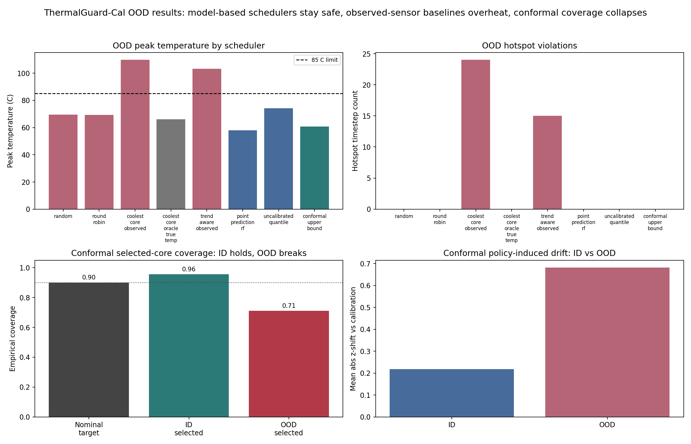

The executive-summary figure is a single portfolio/README overview: OOD peak
temperature by scheduler, OOD hotspot violations, the conformal coverage
collapse from ID to OOD, and conformal policy drift. The detailed per-figure
breakdown follows.

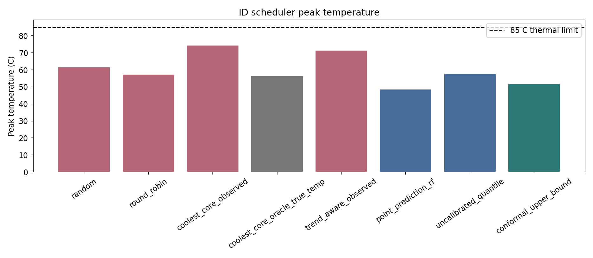

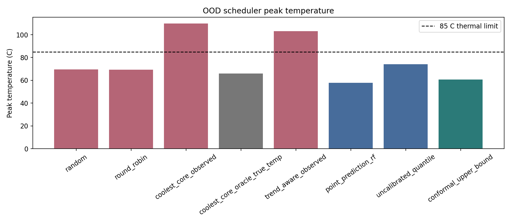

Peak-temperature comparisons show the thermal safety margin against the 85 C
limit. In this quick run, several model-based schedulers avoid hotspots while
some sparse-observed baselines overheat badly under OOD conditions.

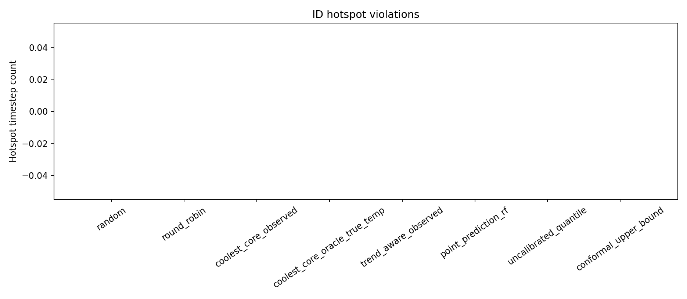

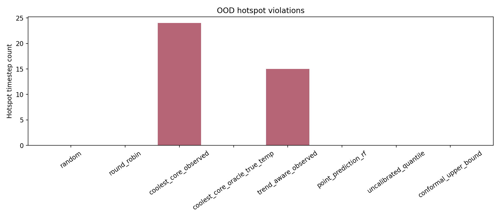

Hotspot bars make the safety failures more direct: ID is thermally easy here,
but OOD separates robust policies from brittle observed-sensor heuristics.

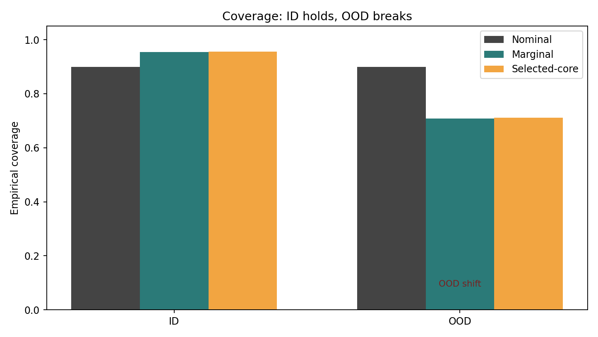

Conformal coverage is reported three ways: nominal target, marginal candidate
coverage, and selected-core coverage. ID selected coverage is near nominal; OOD
coverage collapses under OOD shift. This is why OOD calibration performance should not be
claimed as a formal safety guarantee.

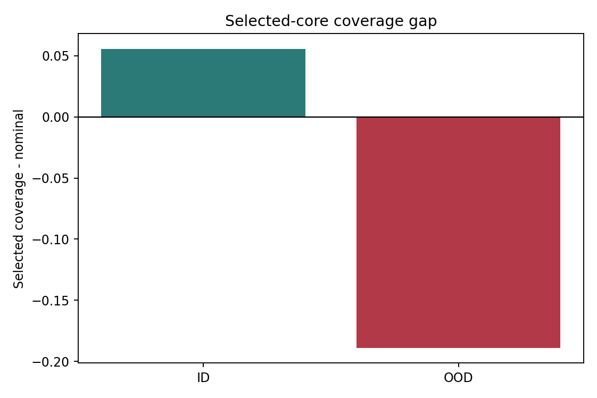

Selected-core coverage is measured separately because the scheduler chooses one
candidate out of 16. That selection step can create a gap from nominal coverage
even before considering policy-induced state drift.

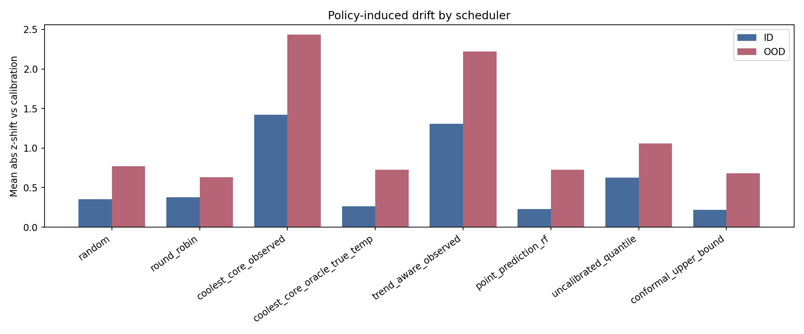

Policy drift compares rollout feature distributions against the calibration
feature distribution. It is a distinct effect from candidate selection bias and
from the deliberate OOD workload shift.

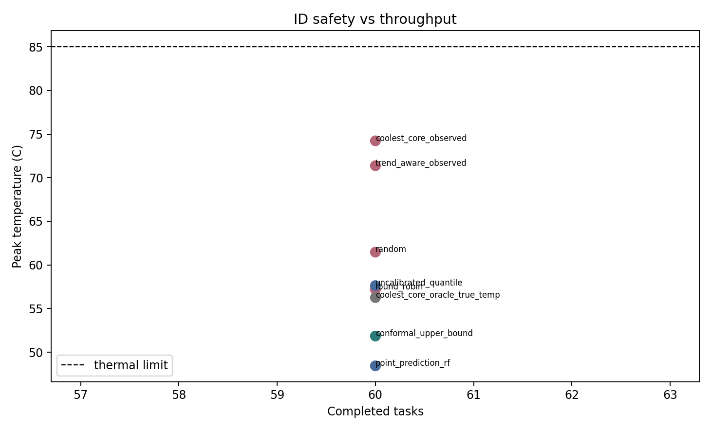

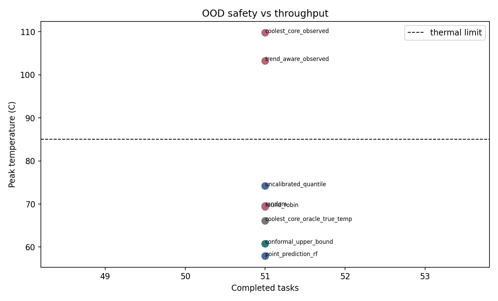

The safety/throughput scatter shows whether lower temperature is being bought
with lost completed work. In the current quick run, model-based schedulers avoid
hotspots without losing completed tasks, but harder presets are still needed if
ID remains too thermally easy.

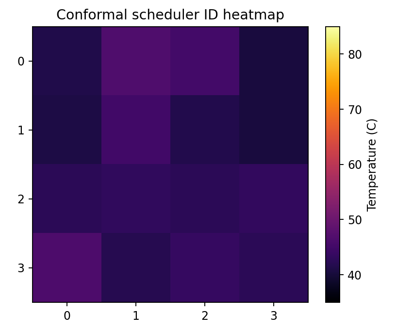

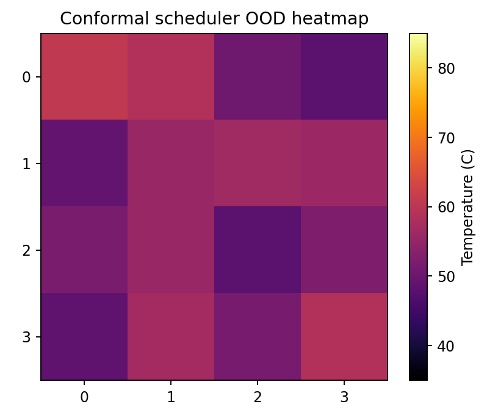

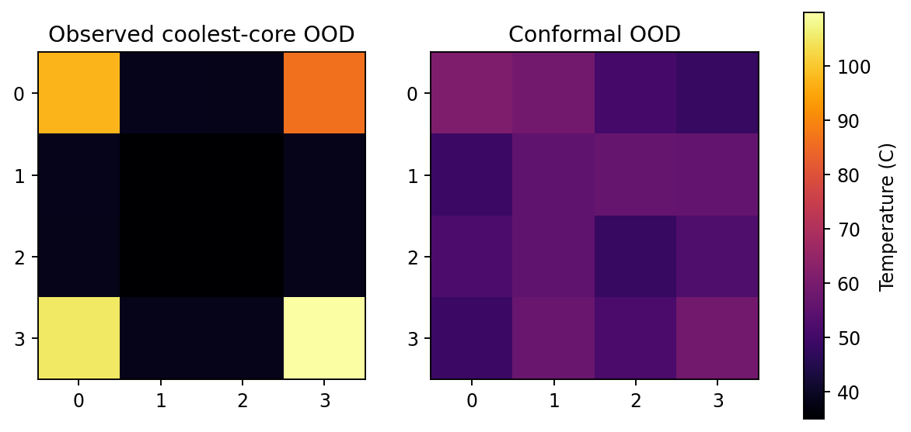

Representative 4x4 heatmaps show the final recorded chip-temperature frame for
the conformal scheduler. The OOD comparison heatmap puts the conformal scheduler
next to a bad observed-sensor baseline (`coolest_core_observed`), which chases
cool sensor readings into a hotspot under the OOD workload.

### What the figures say in plain English

- **ID calibration holds.** On in-distribution workloads, conformal
  selected-core coverage sits near the 0.9 nominal
  target.
- **OOD calibration breaks.** Under the shifted OOD workload, both marginal and
  selected coverage drop well below nominal, so the conformal guarantee should
  not be claimed as a formal OOD safety guarantee.
- **Selected-core coverage is measured separately** from marginal candidate
  coverage, because the scheduler picks one core out of 16 and that selection
  step can move coverage on its own.
- **Some observed-sensor baselines overheat badly in OOD.** Sparse-sensor
  heuristics such as coolest-core-observed and trend-aware-observed run far past
  the 85 C limit on OOD workloads.
- **Model-based schedulers avoid hotspots in this quick run**, staying under the
  thermal limit without losing completed tasks.
- **This quick run still needs harder presets.** ID is thermally easy here, so a
  more challenging preset is needed to validate that the model-based advantage is
  not just an artifact of an easy in-distribution regime.

## Limitations

This is a research MVP, not a validated chip thermal model. It does not include
HotSpot, OpenROAD, chiplets, DVFS, GNNs, active sensing, FPGA logic, or a web
dashboard. The conformal guarantee is marginal on calibration-like data and is
not a formal OOD safety guarantee.
